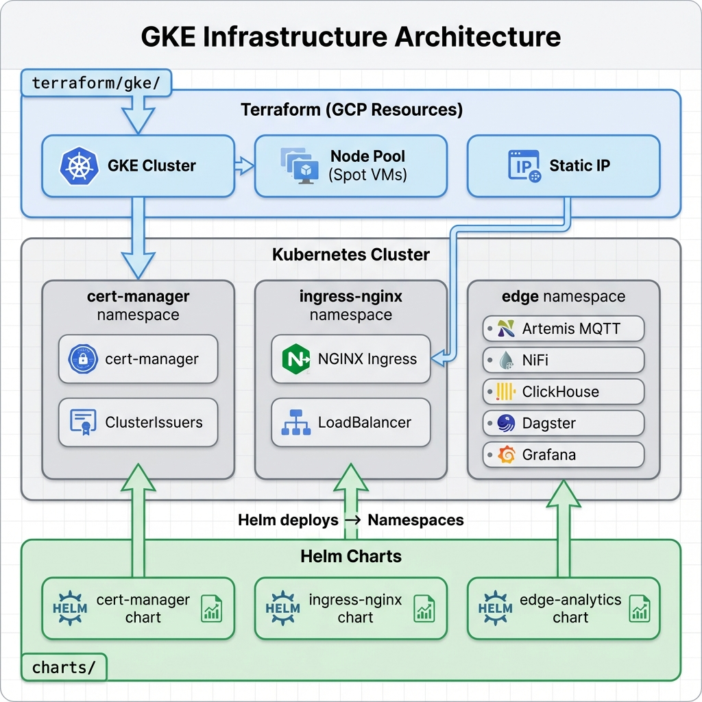

# GKE Infrastructure Architecture

## Overview

Single GKE cluster with clean separation between Terraform (GCP resources) and Helm (Kubernetes resources).

## Architecture Diagram



## Components

### Terraform Layer (GCP Resources)
**Location:** `terraform/gke/`

Creates:
- **GKE Cluster** - Zonal cluster in europe-central2-b
- **Node Pool** - 1-3 nodes with Spot VMs (cost-optimized)
- **Static IP** - External IP for ingress controller

### Kubernetes Layer (3 Namespaces)

#### 1. cert-manager Namespace
**Deployed by:** `charts/infrastructure/cert-manager/` (Helm)

Contains:
- cert-manager controller
- cert-manager webhook
- ClusterIssuers:
  - `letsencrypt-prod` - Production certificates
  - `letsencrypt-staging` - Testing certificates
  - `selfsigned-issuer` - For nip.io domains

#### 2. ingress-nginx Namespace
**Deployed by:** `charts/infrastructure/ingress-nginx/` (Helm)

Contains:
- NGINX Ingress Controller
- LoadBalancer Service (uses static IP from Terraform)

#### 3. edge Namespace
**Deployed by:** `charts/edge-analytics/` (Helm)

Contains:
- Artemis MQTT broker
- Apache NiFi (data processing)
- ClickHouse (database)
- Dagster (orchestration)
- Grafana (monitoring)
- Dashboard API

## Deployment Flow

```
1. Terraform
   ↓
   Creates GKE cluster + Static IP
   
2. kubectl
   ↓
   Configures connection to cluster
   
3. Helm (Infrastructure)
   ↓
   Deploys cert-manager → cert-manager namespace
   Deploys ingress-nginx → ingress-nginx namespace
   
4. Helm (Analytics)
   ↓
   Deploys edge-analytics → edge namespace
```

## Directory Structure

```
terraform/gke/              # Terraform (GCP only)
├── main.tf                 # GKE cluster, node pool, static IP
├── variables.tf
├── terraform.tfvars.example
└── README.md

charts/infrastructure/      # Infrastructure Helm charts
├── cert-manager/
│   ├── Chart.yaml
│   ├── values.yaml
│   └── templates/
│       ├── clusterissuer-letsencrypt-prod.yaml
│       ├── clusterissuer-letsencrypt-staging.yaml
│       └── clusterissuer-selfsigned.yaml
│
└── ingress-nginx/
    ├── Chart.yaml
    └── values.yaml

charts/edge-analytics/      # Analytics Helm chart
└── ...

scripts/
└── deploy-gke.sh          # Automated deployment
```

## Quick Start

```bash
# One command deployment
./scripts/deploy-gke.sh
```

This script automatically:
1. ✅ Runs Terraform (creates GKE cluster)
2. ✅ Configures kubectl
3. ✅ Deploys cert-manager
4. ✅ Deploys ingress-nginx
5. ✅ Deploys edge-analytics

## Key Principles

### Clean Separation
- **Terraform** = GCP cloud resources only
- **Helm** = Kubernetes resources only
- No mixing of responsibilities

### Single Cluster
- One GKE cluster for cost efficiency
- Namespace isolation for different workloads
- Infrastructure and analytics separated by namespace

### Infrastructure vs Analytics
- **Infrastructure** = Core K8s components (cert-manager, ingress)
- **Analytics** = Application workloads (NiFi, ClickHouse, Grafana, etc.)

## Service Access

After deployment, services are accessible via nip.io:

- Grafana: `https://grafana.<INGRESS_IP>.nip.io`
- NiFi: `https://nifi.<INGRESS_IP>.nip.io`
- Dagster: `https://dagster.<INGRESS_IP>.nip.io`
- Dashboard API: `https://api.<INGRESS_IP>.nip.io`

## Cost Optimization

| Feature | Setting | Savings |
|---------|---------|---------|
| Cluster Type | Zonal | ~66% vs regional |
| VMs | Spot VMs | 60-91% vs standard |
| Machine Type | e2-medium | ~50% vs n2-standard |
| Disk | pd-standard | ~80% vs pd-ssd |
| Network Tier | STANDARD | ~25% on egress |

**Estimated Cost:** $12-40/month (1-3 nodes)

## Documentation

- [INFRASTRUCTURE.md](INFRASTRUCTURE.md) - Quick reference guide
- [terraform/gke/README.md](terraform/gke/README.md) - Terraform usage
- [charts/infrastructure/cert-manager/README.md](charts/infrastructure/cert-manager/README.md) - cert-manager details
- [charts/infrastructure/ingress-nginx/README.md](charts/infrastructure/ingress-nginx/README.md) - ingress-nginx details
