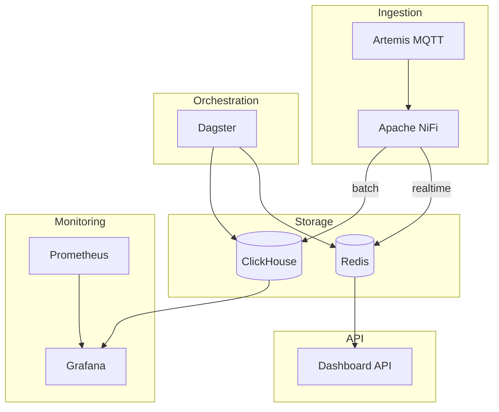
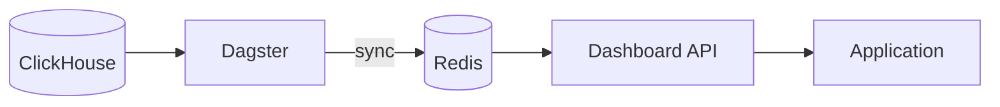

# Edge Analytics - Umbrella Chart

This is an **umbrella chart** that uses only Helm dependencies. No templates to maintain!

## Architecture



## Structure

```
edge-analytics/
├── Chart.yaml       # Dependencies only
├── values.yaml      # Configuration for all dependencies
├── dagster/         # Dagster pipeline code
│   ├── Dockerfile
│   ├── README.md
│   └── pipelines/   # Python pipeline definitions
└── crds/            # Only your custom CRDs
    ├── nifi-cluster.yaml
    ├── clickhouse-cluster.yaml
    ├── dashboard-api.yaml
    └── grafana-dashboards.yaml
```

## Dependencies (Auto-Downloaded)

All infrastructure is managed via Helm dependencies:

| Component | Chart | Purpose |
|-----------|-------|---------|
| Artemis | arkmq-org-broker-operator | MQTT broker |
| ClickHouse | clickhouse-operator | Time-series database |
| Zookeeper | bitnami/zookeeper | NiFi coordination |
| NiFiKop | nifikop | NiFi operator |
| Redis | bitnami/redis | Dashboard cache |
| Dagster | dagster | Data orchestration |
| Prometheus | prometheus | Metrics collection |
| Grafana | grafana | Monitoring dashboards |

## Installation

```bash
# 1. Build Dagster pipeline image (if using custom pipelines)
cd charts/edge-analytics/dagster
docker build -t edge-analytics/dagster-pipelines:latest .
docker push your-registry/dagster-pipelines:latest

# 2. Update dependencies (downloads all charts)
helm dependency update charts/edge-analytics/

# 3. Install everything
helm install edge-analytics charts/edge-analytics/ \
  --namespace edge \
  --create-namespace

# 4. Apply CRDs (after operators are ready)
kubectl apply -f charts/edge-analytics/crds/
```

## Data Orchestration with Dagster



### Dagster Jobs

| Job | Schedule | Description |
|-----|----------|-------------|
| `redis_sync_job` | Every minute | Sync ClickHouse → Redis |
| `hourly_aggregation_job` | Hourly | Verify materialized views |
| `daily_aggregation_job` | Daily 1 AM | Device summaries |
| `clickhouse_maintenance_job` | Daily 3 AM | Optimize tables, cleanup |
| `data_quality_job` | Hourly | Monitor data quality |

### Dagster Sensors

| Sensor | Trigger | Action |
|--------|---------|--------|
| `high_volume_sensor` | >1000 events/min | Extra Redis sync |
| `data_freshness_sensor` | No data >5 min | Quality check |

## Monitoring with Grafana

### Pre-built Dashboards

| Dashboard | Description |
|-----------|-------------|
| Edge Analytics Overview | System health, events/min, device status |
| ClickHouse Metrics | Insert rate, query performance, storage |
| Pipeline Health | NiFi queues, Redis memory, Dagster runs |

### Data Sources

- **Prometheus** - System and application metrics
- **ClickHouse** - Direct telemetry queries
- **Redis** - Cache statistics

### Accessing UIs

```bash
# Grafana (monitoring)
kubectl port-forward -n edge svc/edge-analytics-grafana 3000:80

# Dagster (orchestration)
kubectl port-forward -n edge svc/edge-analytics-dagster-webserver 3001:80

# NiFi (data flow)
kubectl port-forward -n edge svc/edge-nifi 8080:8080
```

## Dashboard API Endpoints

| Endpoint | Description |
|----------|-------------|
| `/api/dashboard/system-health` | Overall system metrics |
| `/api/dashboard/device-stats` | Per-device statistics |
| `/api/dashboard/timeseries` | 1-hour time-series data |
| `/api/dashboard/latest-events` | Latest readings per device |
| `/api/dashboard/hourly-stats` | 24-hour aggregation |
| `/api/dashboard/all` | All data in single request |

## Benefits

✅ **No template maintenance** - All managed by upstream charts  
✅ **Easy upgrades** - Just bump dependency versions  
✅ **Version control** - Only your CRDs in git  
✅ **Consistent** - Use official, tested charts  
✅ **Fast dashboards** - Sub-millisecond Redis queries  
✅ **Reduced ClickHouse load** - Pre-aggregated data  
✅ **Full observability** - Dagster UI for all batch jobs  
✅ **Data quality** - Automated monitoring and alerts

## Dagster vs CronJob

| Feature | CronJob | Dagster |
|---------|---------|---------|
| Observability | Logs only | Full UI, lineage |
| Retry logic | Manual | Built-in |
| Dependencies | None | Asset dependencies |
| Alerting | External | Integrated |
| Backfills | Manual | One-click |
| Scheduling | Cron only | Cron + sensors |
| Testing | Difficult | First-class |

## What You Maintain

Only **3 CRD files** + Dagster pipelines:
- `crds/nifi-cluster.yaml` - Your NiFi cluster spec
- `crds/clickhouse-cluster.yaml` - Your ClickHouse cluster spec
- `crds/dashboard-api.yaml` - Dashboard REST API
- `dagster/pipelines/` - Python pipeline definitions

Everything else is managed by Helm dependencies!
- `crds/dashboard-api.yaml` - Dashboard REST API service

Everything else is managed by dependencies!
