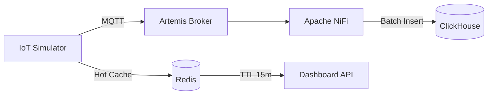

# IoT Device Simulator (Producer)

Simulates 10-100 IoT devices sending telemetry data with realistic trends.

## Data Flow



## Features

### Device Simulation
- **Configurable device count**: 10-100 devices
- **Device types**: temperature-sensor, pressure-sensor, multi-sensor
- **Location assignment**: 16 predefined locations

### Metrics with Realistic Trends

| Metric | Base | Range | Daily Cycle | Trend | Unit |
|--------|------|-------|-------------|-------|------|
| temperature | 25.0 | ±15 | ✅ | +0.001/s | °C |
| pressure | 1013.25 | ±50 | ❌ | 0 | hPa |
| humidity | 60.0 | ±40 | ✅ | -0.0005/s | % |
| voltage | 3.3 | ±0.5 | ❌ | -0.0001/s | V |
| light_intensity | 500.0 | ±800 | ✅ | 0 | lux |
| co2 | 400.0 | ±200 | ✅ | +0.002/s | ppm |
| vibration | 0.5 | ±2 | ❌ | 0 (spikes) | g |
| power_consumption | 150.0 | ±100 | ✅ | +0.001/s | W |
| signal_strength | -70.0 | ±30 | ❌ | 0 | dBm |
| battery_level | 100.0 | 0 | ❌ | -0.005/s | % |

### Anomaly Generation
- **spike**: Sudden 2-5x value jump
- **dropout**: Zero/missing value
- **drift**: Gradual deviation from baseline
- **stuck**: Repeated same value

### Status Levels
- **OK**: Normal operation
- **WARN**: Threshold exceeded
- **CRITICAL**: Critical threshold exceeded

## Redis Hot Cache (10 Base Metrics)

All metrics cached with 15-minute TTL:

| Key | Description |
|-----|-------------|
| `metrics:latest:{device_id}` | Latest reading per device |
| `metrics:avg:temperature:5m` | 5-min avg temperature |
| `metrics:avg:pressure:5m` | 5-min avg pressure |
| `metrics:max:temperature:15m` | 15-min max temperature |
| `metrics:min:temperature:15m` | 15-min min temperature |
| `metrics:count:events:1m` | Events per minute |
| `metrics:active:devices` | Active device set |
| `metrics:warnings:count` | Warning count |
| `metrics:anomalies:count` | Anomaly count |
| `metrics:throughput:msg_per_sec` | Message throughput |

## Installation

### As a Job (One-time run)
```bash
helm install producer charts/producer/ \
  --set simulation.duration=3600 \
  --set devices.count=50
```

### As a Deployment (Continuous)
```bash
helm install producer charts/producer/ \
  --set deployment.enabled=true \
  --set devices.count=100
```

## Configuration

```yaml
# values.yaml overrides

# Device count (10-100)
devices:
  count: 50

# Simulation speed
simulation:
  frequency: 0.5    # Seconds between readings
  batchSize: 10     # Messages per batch

# Enable anomalies
anomalies:
  enabled: true
  probability: 0.02  # 2% chance

# Redis cache
redis:
  enabled: true
  ttl: 900          # 15 minutes
```

## Message Format

```json
{
  "timestamp": "2025-12-19T10:30:00.000Z",
  "device_id": "device-0001",
  "device_type": "multi-sensor",
  "location": "floor-1-north",
  "status": "OK",
  "msg_id": 12345,
  "temperature": 25.42,
  "pressure": 1013.50,
  "humidity": 58.3,
  "voltage": 3.28,
  "light_intensity": 650.0,
  "co2": 412.5,
  "vibration": 0.52,
  "power_consumption": 142.8,
  "signal_strength": -68.5,
  "battery_level": 98.2
}
```

## ClickHouse Schema

```sql
CREATE TABLE telemetry.events (
    timestamp DateTime64(3) CODEC(DoubleDelta),
    device_id LowCardinality(String),
    device_type LowCardinality(String),
    location LowCardinality(String),
    status LowCardinality(String),
    msg_id UInt64 CODEC(Delta),
    temperature Float32 CODEC(Gorilla),
    pressure Float32 CODEC(Gorilla),
    humidity Float32 CODEC(Gorilla),
    voltage Float32 CODEC(Gorilla),
    light_intensity Float32 CODEC(Gorilla),
    co2 Float32 CODEC(Gorilla),
    vibration Float32 CODEC(Gorilla),
    power_consumption Float32 CODEC(Gorilla),
    signal_strength Float32 CODEC(Gorilla),
    battery_level Float32 CODEC(Gorilla)
) ENGINE = MergeTree()
PARTITION BY toYYYYMM(timestamp)
ORDER BY (device_id, timestamp)
TTL timestamp + INTERVAL 90 DAY;
```

## Monitoring

Check Redis hot cache:
```bash
redis-cli -h redis-host -a password

# Get latest reading for device
HGETALL metrics:latest:device-0001

# Get 5-min average temperature
GET metrics:avg:temperature:5m

# Get active device count
SCARD metrics:active:devices

# Get throughput
GET metrics:throughput:msg_per_sec
```
