# Edge Analytics K8s Environment

## Architecture

This edge analytics environment provides a complete data pipeline for collecting, processing, and storing telemetry data from IoT devices using an **umbrella chart** approach with operator-based management.

### Data Flow Diagram

```mermaid
flowchart LR
    subgraph Cloud ["☁️ GCP"]
        subgraph GKE ["GKE Cluster (Zonal)"]
            subgraph Sources
                IoT[🌡️ IoT Devices]
            end

            subgraph Ingestion
                MQTT[📨 Artemis MQTT]
            end

            subgraph Processing ["Apache NiFi"]
                Consume[ConsumeMQTT]
                Eval[EvaluateJsonPath]
                Merge[MergeContent<br/>batch 100-500]
                PubRedis[PublishRedis]
            end

            subgraph Storage
                CH[(ClickHouse)]
                Redis[(Redis)]
            end

            subgraph Orchestration
                Dagster[⚙️ Dagster]
            end

            subgraph Serving
                API[Dashboard API]
                Grafana[📊 Grafana]
            end

            subgraph Apps
                Dashboard[Flutter App]
            end
        end
        
        subgraph Infra ["Infrastructure"]
            TF[Terraform]
            CM[cert-manager]
            LE[Let's Encrypt]
            Ingress[NGINX Ingress]
            NipIO[nip.io DNS]
        end
    end

    TF -->|provisions| GKE
    CM -->|manages| LE
    Ingress -->|routes| API
    Ingress -->|routes| Grafana
    NipIO -->|resolves| Ingress

    IoT -->|telemetry| MQTT
    MQTT --> Consume
    Consume --> Eval
    Eval --> Merge
    Eval --> PubRedis
    Merge -->|batch insert| CH
    PubRedis -->|real-time| Redis
    CH --> Dagster
    Dagster -->|sync| Redis
    Redis --> API
    CH --> Grafana
    Redis --> Grafana
    API --> Dashboard
    Grafana --> Dashboard
```



### Component Diagram

```mermaid
graph TB
    subgraph Kubernetes ["☸️ Kubernetes Cluster"]
        subgraph Operators ["Operators Layer"]
            ArkMQ[ArkMQ Operator]
            NiFiKop[NiFiKop Operator]
            CHOp[ClickHouse Operator]
        end

        subgraph Data ["Data Layer"]
            Artemis[("Artemis MQTT<br/>:1883")]
            NiFi["Apache NiFi<br/>:8080"]
            ClickHouse[("ClickHouse<br/>:8123")]
            ZK[("Zookeeper<br/>:2181")]
        end

        subgraph Cache ["Cache Layer"]
            Redis[("Redis<br/>:6379")]
        end

        subgraph Orchestration ["Orchestration Layer"]
            DagsterUI["Dagster UI<br/>:3000"]
            DagsterDaemon[Dagster Daemon]
            DagsterPG[("PostgreSQL")]
        end

        subgraph Monitoring ["Monitoring Layer"]
            Prometheus["Prometheus<br/>:9090"]
            Grafana["Grafana<br/>:3000"]
        end

        subgraph API ["API Layer"]
            DashAPI["Dashboard API<br/>:8000"]
        end

        subgraph Apps ["Applications Layer"]
            Flutter["Flutter Dashboard<br/>Mobile/Web"]
        end

        subgraph Ingress ["Ingress Layer"]
            NGINX["NGINX Ingress<br/>nip.io"]
            CertMgr["cert-manager<br/>Let's Encrypt"]
        end
    end

    ArkMQ -.->|manages| Artemis
    DashAPI -->|serves| Flutter
    Flutter -->|queries| DashAPI
    NGINX -->|routes to| DashAPI
    NGINX -->|routes to| Grafana
    CertMgr -->|TLS certs| NGINX
    NiFiKop -.->|manages| NiFi
    CHOp -.->|manages| ClickHouse
    NiFi --> ZK
    DagsterUI --> DagsterPG
    DagsterDaemon --> DagsterPG
    Prometheus -->|scrapes| NiFi
    Prometheus -->|scrapes| ClickHouse
    Prometheus -->|scrapes| Redis
    Grafana -->|queries| Prometheus
    Grafana -->|queries| ClickHouse
```



### Sequence Diagram - Data Flow


**Three Data Paths**:
1. **Historical Path** (batched): MQTT → NiFi (batch 100-500) → ClickHouse → Dagster → Redis → API
2. **Real-time Path** (instant): MQTT → NiFi → Redis (direct) → API
3. **Orchestration Path**: Dagster schedules → ClickHouse maintenance/aggregations → Redis sync

### Components (All Operator-Managed)

#### 1. **ArkMQ Operator + Artemis MQTT Broker**
- **Purpose**: Official operator managing Apache ActiveMQ Artemis message broker
- **Protocol**: MQTT (port 1883)
- **Deployment**: Helm dependency (ArkMQ operator v2.1.0)
- **Management**: CRD-based (ActiveMQArtemis custom resource)
- **License**: Apache 2.0 (open source)

#### 2. **NiFiKop Operator + Apache NiFi**
- **Purpose**: Operator managing NiFi for data ingestion and processing
- **Deployment**: Helm dependency (NiFiKop v1.9.0)
- **Features**:
  - Dataflow lifecycle management via CRDs
  - Graceful scaling and rolling upgrades
  - ClickHouse JDBC driver pre-installed
  - Redis NAR bundle pre-installed for real-time streaming
  - **Batched inserts** (100-500 messages) to ClickHouse
  - **Real-time streaming** to Redis for ultra-fast dashboards
- **UI Access**: Port 8080
- **Dependencies**: Zookeeper (Bitnami chart)

#### 3. **ClickHouse Operator + ClickHouse Database**
- **Purpose**: Operator managing ClickHouse time-series database
- **Deployment**: Helm dependency (Altinity operator v0.23.0)
- **Schema**: 
  - Database: `telemetry`
  - Table: `events` (timestamp, device_id, temperature, pressure, status, msg_id)
- **Access**: HTTP interface on port 8123

#### 4. **Test Producer**
- **Purpose**: Generate test telemetry data
- **Deployment**: Standalone Helm chart
- **Output**: Publishes JSON messages to Artemis MQTT

#### 5. **Redis (Dashboard Cache & Real-time Stream)**
- **Purpose**: High-speed cache AND real-time data streaming for dashboards
- **Deployment**: Bitnami Redis chart (standalone or HA)
- **Data Sources**:
  - **CronJob sync**: Pre-aggregated data from ClickHouse (every minute)
  - **NiFi direct**: Real-time device state & event stream (instant)
- **Features**:
  - Sub-millisecond query response for dashboards
  - Real-time device state via Hash (`device:{id}`)
  - Event replay via Stream (`telemetry:stream`)
  - Pub/Sub for live updates (`telemetry:live`)
  - Time-to-live (TTL) based data expiration
  - Memory-optimized with LRU eviction
- **Access**: Port 6379
- **Password**: Configurable via `values.yaml`

#### 6. **Dashboard API**
- **Purpose**: REST API for dashboard frontends (Flutter, web apps)
- **Deployment**: FastAPI service with Redis + ClickHouse drivers
- **Redis Endpoints** (hot cache, <1ms response):
  - `/api/dashboard/redis-metrics` - 3 hot metrics (avg temp, pressure, throughput)
  - `/api/realtime/devices` - All device current states
  - `/api/realtime/device/{id}` - Single device state
  - `/api/realtime/stream` - Recent events from stream
  - `/api/realtime/stats` - Real-time system stats
- **ClickHouse Endpoints** (historical queries):
  - `/api/dashboard/clickhouse/temperature-timeseries` - Last 60 min temperature data
  - `/api/dashboard/clickhouse/hourly-stats` - 24-hour event aggregation
  - `/api/dashboard/clickhouse/device-stats` - Device statistics table
- **Aggregated Endpoints** (from Dagster sync):
  - `/api/dashboard/system-health` - Overall system metrics
  - `/api/dashboard/device-stats` - Per-device statistics
  - `/api/dashboard/timeseries` - Time-series data (1h)
  - `/api/dashboard/all` - All data in single request
- **Access**: Port 8000

#### 7. **Dagster (Data Orchestration)**
- **Purpose**: Orchestrate batch jobs, ClickHouse management, and data pipelines
- **Deployment**: Helm dependency (Dagster v1.7.0)
- **Features**:
  - **Scheduled Jobs**: Redis sync (every minute), maintenance (daily), aggregations
  - **Sensors**: High-volume detection, data freshness monitoring
  - **Asset Tracking**: Full lineage and observability for all data assets
  - **ClickHouse Management**: Table optimization, partition cleanup, TTL enforcement
  - **Data Quality**: Automated anomaly detection and quality metrics
- **UI Access**: Port 3000 (webserver)
- **Replaces**: Simple CronJobs with full orchestration platform

**Dagster Jobs**:
| Job | Schedule | Description |
|-----|----------|-------------|
| `redis_sync_job` | Every minute | Sync ClickHouse → Redis |
| `hourly_aggregation_job` | Hourly | Verify materialized views |
| `daily_aggregation_job` | Daily 1 AM | Device summaries |
| `clickhouse_maintenance_job` | Daily 3 AM | Optimize & cleanup |
| `data_quality_job` | Hourly | Quality monitoring |

#### 8. **Prometheus (Metrics Collection)**
- **Purpose**: Collect and store metrics from all components
- **Deployment**: Helm dependency (Prometheus v25.27.0)
- **Features**:
  - Scrapes metrics from ClickHouse, NiFi, Redis, Dagster
  - 7-day retention by default
  - Node exporter for system metrics
- **Access**: Port 9090
- **Scrape Targets**:
  - `clickhouse:9363` - ClickHouse metrics
  - `edge-nifi:9092` - NiFi metrics
  - `redis:9121` - Redis exporter
  - `dagster-webserver:80` - Dagster metrics

#### 9. **Grafana (Monitoring Dashboards)**
- **Purpose**: Visualization and monitoring dashboards
- **Deployment**: Helm dependency (Grafana v8.5.0)
- **Features**:
  - Pre-configured data sources (Prometheus, ClickHouse, Redis)
  - Pre-built dashboards for edge analytics
  - Alerting and notification support
- **Access**: Port 3000
- **Credentials**: admin / admin-secret (configurable)
- **Pre-installed Plugins**:
  - `grafana-clickhouse-datasource`
  - `redis-datasource`
  - `grafana-piechart-panel`

**Pre-built Dashboards**:
| Dashboard | Description | Datasource |
|-----------|-------------|------------|
| Edge Analytics Overview | System health, events/min, device status | Prometheus |
| ClickHouse Metrics | Insert rate, query performance, storage | Prometheus + ClickHouse |
| Pipeline Health | NiFi queues, Redis memory, Dagster runs | Prometheus + ClickHouse |
| Device Analytics | Per-device metrics, battery, CPU, location | ClickHouse |
| Data Quality & Anomalies | Warning rate, anomalies, stale devices | ClickHouse |

#### 10. **Flutter Dashboard App**
- **Purpose**: Cross-platform dashboard for mobile and web
- **Location**: `/apps/flutter-dashboard/`
- **Features**:
  - **Redis Metrics** (3 cards, auto-refresh 10s):
    - Average Temperature
    - Average Pressure  
    - Throughput (events/sec)
  - **ClickHouse Charts** (2 visualizations):
    - Temperature Timeseries (60 min line chart)
    - Hourly Events (24h bar chart)
  - Device Statistics Table
  - Dark theme with Material Design 3
- **Dependencies**: fl_chart, provider, http
- **Build Commands**:
  ```bash
  cd apps/flutter-dashboard
  flutter pub get
  flutter run -d chrome    # Web
  flutter run -d android   # Mobile
  ```
- **API Configuration**: Set `API_BASE_URL` in `lib/services/metrics_service.dart`

## Infrastructure (Terraform)

### GKE Cluster (Cheapest Configuration)

The infrastructure is provisioned via Terraform in `/gke-infrastructure/`:

```
gke-infrastructure/
├── main.tf              # GKE cluster + node pool
├── variables.tf         # Configuration variables
├── cert-manager.tf      # cert-manager + Let's Encrypt
├── ingress-nginx.tf     # NGINX Ingress + nip.io
├── terraform.tfvars.example
└── README.md
```

**Cost Optimization Features**:
| Feature | Savings |
|---------|---------|
| Zonal cluster (vs Regional) | ~66% on control plane |
| Spot VMs (vs Standard) | 60-91% on compute |
| e2-medium (vs n2-standard) | ~50% on compute |
| pd-standard (vs pd-ssd) | ~80% on storage |
| Standard network tier | ~25% on egress |

**Estimated Monthly Cost**: ~$12-40/month (1-3 nodes)

### Infrastructure Components

#### 11. **NGINX Ingress Controller**
- **Purpose**: Route external traffic to services
- **Deployment**: Helm chart via Terraform
- **Features**:
  - Static IP for consistent access
  - TLS termination
  - Rate limiting and CORS
- **Integration**: Works with nip.io for wildcard DNS

#### 12. **cert-manager + Let's Encrypt**
- **Purpose**: Automatic TLS certificate management
- **Deployment**: Helm chart via Terraform
- **ClusterIssuers**:
  - `letsencrypt-prod` - Production certificates
  - `letsencrypt-staging` - Testing (no rate limits)
  - `selfsigned-issuer` - Internal services / nip.io

#### 13. **nip.io (Wildcard DNS)**
- **Purpose**: DNS without configuration
- **How it works**: `app.1.2.3.4.nip.io` resolves to `1.2.3.4`
- **Service URLs**:
  - `https://grafana.<IP>.nip.io`
  - `https://nifi.<IP>.nip.io`
  - `https://dagster.<IP>.nip.io`
  - `https://api.<IP>.nip.io`

### Terraform Quick Start

```bash
# 1. Navigate to terraform directory
cd gke-infrastructure

# 2. Configure variables
cp terraform.tfvars.example terraform.tfvars
vim terraform.tfvars  # Set project_id, email

# 3. Initialize and apply
terraform init
terraform plan
terraform apply

# 4. Configure kubectl
$(terraform output -raw kubeconfig_command)

# 5. Deploy applications
cd ../../
./scripts/deploy.sh all

# 6. Get service URLs
terraform output service_urls
```

## Deployment

### Prerequisites

- Kubernetes cluster (1.21+)
- Helm 3.x
- kubectl configured
- cert-manager (installed automatically by deployment script)

### Quick Start (Umbrella Chart)

```bash
# Deploy everything via umbrella chart
./scripts/deploy.sh
```

This script will:
1. Install cert-manager (for operators)
2. Download all Helm dependencies (ArkMQ, NiFiKop, ClickHouse operator, Zookeeper)
3. Deploy umbrella chart with all operators
4. Apply your custom CRDs (NiFi cluster, ClickHouse cluster)
5. Initialize ClickHouse schema

### Manual Deployment

```bash
# 1. Create namespace
kubectl create namespace edge

# 2. Install cert-manager
kubectl apply -f https://github.com/cert-manager/cert-manager/releases/download/v1.13.0/cert-manager.yaml

# 3. Download dependencies
cd charts/edge-analytics
helm dependency update
cd ../..

# 4. Install umbrella chart (all operators)
helm install edge-analytics charts/edge-analytics/ \
  --namespace edge \
  --create-namespace \
  --wait --timeout=10m

# 5. Apply CRDs (your custom configs)
kubectl apply -f charts/edge-analytics/crds/ -n edge

# 6. Initialize ClickHouse schema
kubectl apply -f manifests/clickhouse-schema.yaml -n edge

# 7. Deploy test producer (optional)
helm install producer charts/producer/ -n edge
```

## Chart Structure

### Umbrella Chart (charts/edge-analytics/)

```
edge-analytics/
├── Chart.yaml          # Dependencies only (no templates!)
├── values.yaml         # Configuration for all dependencies
├── README.md
├── ARTEMIS_OPTIONS.md
└── crds/               # Custom resources you maintain
    ├── nifi-cluster.yaml       # Your NiFi configuration
    ├── clickhouse-cluster.yaml # Your ClickHouse configuration
    ├── dashboard-api.yaml      # Dashboard API (FastAPI)
    └── grafana-dashboards.yaml # Pre-built Grafana dashboards (5)
```

### Flutter Dashboard (apps/flutter-dashboard/)

```
flutter-dashboard/
├── pubspec.yaml            # Dependencies (fl_chart, provider, http)
├── lib/
│   ├── main.dart           # App entry point
│   ├── models/
│   │   └── metrics.dart    # Data models
│   ├── services/
│   │   └── metrics_service.dart  # API client
│   ├── providers/
│   │   └── metrics_provider.dart # State management
│   ├── screens/
│   │   └── dashboard_screen.dart # Main UI
│   └── widgets/
│       ├── metric_card.dart      # Redis metric cards
│       ├── temperature_chart.dart # ClickHouse line chart
│       ├── events_chart.dart     # ClickHouse bar chart
│       └── device_table.dart     # Device statistics
└── README.md
```

**Dependencies in Chart.yaml:**
- `arkmq-org-broker-operator` - Artemis operator
- `clickhouse-operator` - ClickHouse operator
- `zookeeper` - From Bitnami (for NiFi)
- `nifikop` - NiFi operator

### What You Maintain

**CRD Files in `charts/edge-analytics/crds/`:**
1. `nifi-cluster.yaml` - NiFi cluster spec
2. `clickhouse-cluster.yaml` - ClickHouse cluster spec  
3. `dashboard-api.yaml` - Dashboard API deployment
4. `grafana-dashboards.yaml` - 5 pre-built dashboards

**Flutter App in `apps/flutter-dashboard/`:**
- Cross-platform dashboard (mobile/web)
- Reads 3 metrics from Redis, 2 from ClickHouse

**Everything else is Helm dependencies** - downloaded automatically, no template maintenance!

## Configuration

### NiFi Data Flow

After deployment, configure the NiFi flow via the UI:

1. **Access NiFi UI**:
   ```bash
   kubectl port-forward -n edge svc/edge-nifi 8080:8080
   ```
   Open: http://localhost:8080/nifi

2. **Create Flow** (see `manifests/nifi-flow-config.yaml` for details):
   - **ConsumeMQTT**: Subscribe to `raw-telemetry` topic from Artemis
   - **EvaluateJsonPath**: Extract telemetry fields
   - **PutDatabaseRecord**: Insert into ClickHouse

3. **Configure ClickHouse Connection**:
   - URL: `jdbc:clickhouse://clickhouse-telemetry-db.clickhouse.svc.cluster.local:8123/telemetry`
   - Driver: Pre-installed ClickHouse JDBC driver
   - User: `admin` / Password: `password`

## Verification

### Check Deployments

```bash
# Check all pods
kubectl get pods -n edge

# Check operators
kubectl get pods -n edge | grep operator

# Check custom resources
kubectl get nificlusters -n edge
kubectl get clickhouseinstallations -n edge
kubectl get activemqartemis -n edge  # If using ArkMQ
```

## Upgrading

### Upgrade Dependencies

```bash
# Update dependency versions in Chart.yaml
vim charts/edge-analytics/Chart.yaml

# Update dependencies
helm dependency update charts/edge-analytics/

# Upgrade deployment
helm upgrade edge-analytics charts/edge-analytics/ -n edge
```

### Modify Your Configurations

```bash
# Edit your CRDs
vim charts/edge-analytics/crds/nifi-cluster.yaml
vim charts/edge-analytics/crds/clickhouse-cluster.yaml

# Apply changes
kubectl apply -f charts/edge-analytics/crds/ -n edge
```

## Benefits of This Architecture

### 1. **Minimal Maintenance**
- Only 2 CRD files to maintain
- All infrastructure managed by upstream Helm charts
- No template files in your repo

### 2. **Operator-Based**
- Consistent CRD pattern across all components
- Automatic reconciliation and healing
- Advanced lifecycle management

### 3. **Easy Upgrades**
- Bump dependency versions in Chart.yaml
- Run `helm dependency update`
- No manual template updates

## Troubleshooting

### Operators not starting

```bash
# Check cert-manager
kubectl get pods -n cert-manager

# Check operator logs
kubectl logs -n edge -l app.kubernetes.io/name=nifikop
kubectl logs -n edge -l app.kubernetes.io/name=clickhouse-operator
```

### NiFi cluster not creating

```bash
# Check NiFiCluster status
kubectl describe nificluster edge-nifi -n edge

# Check NiFiKop operator logs
kubectl logs -n edge -l app.kubernetes.io/name=nifikop
```

### ClickHouse connection issues

```bash
# Check ClickHouse pods
kubectl get pods -n edge -l clickhouse.altinity.com/chi=telemetry-db

# Test connection
kubectl exec -n edge clickhouse-telemetry-db-0-0-0 -- \
  clickhouse-client --query="SELECT 1"
```

## Cleanup

```bash
# Uninstall umbrella chart (removes all operators and resources)
helm uninstall edge-analytics -n edge

# Delete namespace
kubectl delete namespace edge

# Uninstall cert-manager (if not used by other apps)
kubectl delete -f https://github.com/cert-manager/cert-manager/releases/download/v1.13.0/cert-manager.yaml
```

## References

- [ArkMQ Broker Operator](https://arkmq.org/)
- [Apache NiFi Documentation](https://nifi.apache.org/docs.html)
- [NiFiKop Operator](https://konpyutaika.github.io/nifikop/)
- [ClickHouse Documentation](https://clickhouse.com/docs)
- [Altinity ClickHouse Operator](https://github.com/Altinity/clickhouse-operator)


```
Source Devices → Artemis MQTT → NiFi → ClickHouse
                                  ↓
                          (Data Processing)
```

### Components

#### 1. **Artemis MQTT Broker**
- **Purpose**: Message broker for collecting telemetry data from source devices
- **Protocol**: MQTT (port 1883)
- **Deployment**: Helm chart (`charts/artemis/`)
- **Configuration**: 
  - Single replica for edge deployment
  - Username: `admin` / Password: `admin`

#### 2. **Apache NiFi** (via NiFiKop Operator)
- **Purpose**: Data ingestion and processing
- **Deployment**: Helm chart (`charts/nifi-infra/`)
- **Features**:
  - Managed by NiFiKop Kubernetes operator
  - Dataflow lifecycle management via CRDs
  - Graceful scaling and rolling upgrades
  - ClickHouse JDBC driver pre-installed
- **UI Access**: Port 8080
- **Dependencies**: Zookeeper (deployed automatically)

#### 3. **ClickHouse**
- **Purpose**: Time-series database for telemetry storage
- **Deployment**: Helm chart (`charts/clickhouse-infra/`)
- **Schema**: 
  - Database: `telemetry`
  - Table: `events` (timestamp, device_id, temperature, pressure, status, msg_id)
- **Access**: HTTP interface on port 8123

#### 4. **Test Producer**
- **Purpose**: Generate test telemetry data
- **Deployment**: Helm chart (`charts/producer/`)
- **Output**: Publishes JSON messages to Artemis MQTT

## Deployment

### Prerequisites

- Kubernetes cluster (1.21+)
- Helm 3.x
- kubectl configured

### Quick Start

```bash
# Deploy all components
./deploy-edge-analytics.sh
```

This script will:
1. Install cert-manager (for NiFiKop)
2. Install NiFiKop operator
3. Deploy ClickHouse database
4. Deploy Artemis MQTT broker
5. Deploy NiFi with Zookeeper

### Manual Deployment

```bash
# 1. Create namespaces
kubectl create namespace clickhouse
kubectl create namespace nifi

# 2. Install cert-manager
kubectl apply -f https://github.com/cert-manager/cert-manager/releases/download/v1.13.0/cert-manager.yaml

# 3. Install NiFiKop operator
helm repo add konpyutaika https://konpyutaika.github.io/helm-charts
helm install nifikop konpyutaika/nifikop --namespace=nifi --set namespaces={"nifi"}

# 4. Deploy ClickHouse
helm install clickhouse charts/clickhouse-infra/ --namespace=clickhouse

# 5. Initialize ClickHouse schema
kubectl apply -f manifests/clickhouse-schema.yaml

# 6. Deploy Artemis
helm install artemis-activemq charts/artemis/

# 7. Deploy NiFi
helm install nifi charts/nifi-infra/ --namespace=nifi

# 8. Deploy test producer (optional)
helm install producer charts/producer/
```

## Configuration

### NiFi Data Flow

After deployment, configure the NiFi flow via the UI:

1. **Access NiFi UI**:
   ```bash
   kubectl port-forward -n nifi svc/edge-nifi 8080:8080
   ```
   Open: http://localhost:8080/nifi

2. **Create Flow** (see `manifests/nifi-flow-config.yaml` for details):
   - **ConsumeMQTT**: Subscribe to `raw-telemetry` topic from Artemis
   - **EvaluateJsonPath**: Extract telemetry fields
   - **PutDatabaseRecord**: Insert into ClickHouse

3. **Configure ClickHouse Connection**:
   - URL: `jdbc:clickhouse://clickhouse-telemetry-db.clickhouse.svc.cluster.local:8123/telemetry`
   - Driver: Pre-installed ClickHouse JDBC driver
   - User: `admin` / Password: `password`

## Verification

### Check Deployments

```bash
# Check all pods
kubectl get pods -A | grep -E 'nifi|clickhouse|artemis'

# Check NiFi cluster status
kubectl get nificlusters -n nifi

# Check ClickHouse installation
kubectl get chi -n clickhouse
```

### Test Data Flow

```bash
# 1. Deploy test producer
helm install producer charts/producer/

# 2. Check NiFi is processing data
kubectl logs -n nifi -l nifi_cr=edge-nifi --tail=50

# 3. Query ClickHouse
kubectl exec -n clickhouse clickhouse-telemetry-db-0-0-0 -- \
  clickhouse-client -u admin --password=password \
  --query="SELECT count(*) FROM telemetry.events"
```

## Helm Charts

### charts/nifi-infra/
- **Version**: 1.0.0
- **App Version**: NiFi 2.0.0
- **Dependencies**: NiFiKop operator
- **Values**: See `charts/nifi-infra/values.yaml`

### charts/clickhouse-infra/
- **Version**: 1.0.0
- **App Version**: ClickHouse 24.3
- **Values**: See `charts/clickhouse-infra/values.yaml`

### charts/artemis/
- **Version**: 0.1.1
- **App Version**: ActiveMQ Artemis latest
- **Values**: See `charts/artemis/values.yaml`

### charts/producer/
- **Version**: 1.0.0
- **Purpose**: Test data generator

## Customization

### Modify Resource Limits

Edit `values.yaml` in respective charts:

```bash
# NiFi resources
helm upgrade nifi charts/nifi-infra/ \
  --set nifi.resources.limits.memory=4Gi \
  --namespace=nifi

# ClickHouse resources
helm upgrade clickhouse charts/clickhouse-infra/ \
  --set clickhouse.resources.limits.memory=2Gi \
  --namespace=clickhouse
```

### Scale Components

```bash
# Scale Artemis replicas
helm upgrade artemis-activemq charts/artemis/ --set replicas=2

# Scale NiFi nodes (via NiFiKop)
kubectl edit nificluster edge-nifi -n nifi
# Add more nodes to spec.nodes[]
```

## Troubleshooting

### NiFi not starting

```bash
# Check NiFiKop operator logs
kubectl logs -n nifi -l app.kubernetes.io/name=nifikop

# Check NiFi cluster status
kubectl describe nificluster edge-nifi -n nifi

# Check Zookeeper
kubectl logs -n nifi zookeeper-0
```

### ClickHouse connection issues

```bash
# Check ClickHouse pods
kubectl get pods -n clickhouse

# Test connection
kubectl exec -n clickhouse clickhouse-telemetry-db-0-0-0 -- \
  clickhouse-client --query="SELECT 1"
```

### Artemis MQTT issues

```bash
# Check Artemis logs
kubectl logs -l app=artemis-activemq-artemis

# Test MQTT connection
kubectl run mqtt-test --rm -it --image=eclipse-mosquitto:latest -- \
  mosquitto_sub -h artemis-activemq-artemis-master-0.artemis-activemq-artemis-master.default.svc.cluster.local \
  -t raw-telemetry -u admin -P admin
```

## Cleanup

```bash
# Uninstall all components
helm uninstall nifi -n nifi
helm uninstall clickhouse -n clickhouse
helm uninstall artemis-activemq
helm uninstall producer
helm uninstall nifikop -n nifi

# Delete namespaces
kubectl delete namespace nifi clickhouse
```

## References

- [Apache NiFi Documentation](https://nifi.apache.org/docs.html)
- [NiFiKop Operator](https://konpyutaika.github.io/nifikop/)
- [ClickHouse Documentation](https://clickhouse.com/docs)
- [ActiveMQ Artemis](https://activemq.apache.org/components/artemis/)
